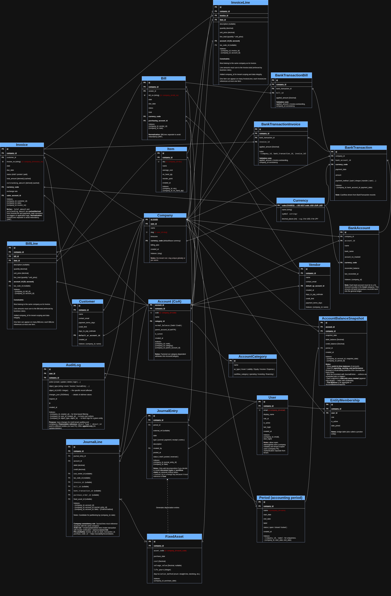

# Accounting Web App - Contributing Guide

A production-ready backend for accounting web app built with Django. Implements **double-entry bookkeeping**, **tenant isolation**, **invoices/bills**, **bank transactions**, **fixed-asset depreciation** and **reporting** *(trial balance, income statement, balance sheet, cashflow, AR/AP aging)*. Includes **admin UI** for **rapid prototyping** and **materialized views** for fast reporting.


## About
Built from scratch using concepts learned from various tutorials:
- Accounting fundamentals: 
  - [*Principles of Accounting*](https://alison.com/course/principles-of-accounting)
  - [*Introduction to Business Accounting*](https://alison.com/course/introduction-to-business-accounting)
  - [*Cost Accounting & Classification*](https://alison.com/course/introduction-to-cost-accounting-and-cost-classification)
  - [*Basic Concepts of Financial Analysis*](https://alison.com/course/fundamental-concepts-of-financial-analysis)
-  Product research: 
    - [*QuickBooks Online*](https://www.youtube.com/@quickbooks) & [*Xero*](https://www.youtube.com/@xero) feature walkthroughs
- Schema & prototyping: 
  - [*How to Create Accounting Database in MS Access (Professional)*](https://www.youtube.com/watch?v=0zcYwFU5OKE)
- Databases & multi-tenant: 
  - [*Advanced Diploma in Database Systems (modules 1–8)*](https://alison.com/course/advanced-diploma-in-database-systems)
  - [*Multi-Tenant SaaS Architecture in 3 Simple Steps*](https://www.youtube.com/watch?v=bFLGwVyIotA)

This is my implementation and learning exercise — credit given above.

## What to look at
- `admin/` — registered models
- `management/commands/` — demo data management commands
- `tests/` — automated tests


## Database Design

The following ER diagram illustrates the relationships between the models:



## Getting Started

### Create & Activate Virtual Environment

1. **Clone the repo**
    ```bash
    git clone https://github.com/webQbe/react-django_accounting_app.git
    ```

2. **Navigate to your project directory**:

   ```bash
   cd react-django_accounting_app
   ```

3. **Create a virtual environment**:

   ```bash
   python3.12 -m venv .venv
   ```

   This will create a `.venv` directory in your project folder.

4. **Activate the virtual environment**:

   * On **Linux/macOS**:

     ```bash
     source .venv/bin/activate
     ```

   * On **Windows**:

     ```bash
     .venv\Scripts\Activate.ps1
     ```

   After activation, your prompt should change to indicate the active environment, 
   e.g., `(.venv)`.


5. Install dependencies (Python packages):  
  ```bash
  pip install -r requirements.txt
  ```

6. Install Database: PostgreSQL (via Docker)
  ```bash
  docker run --name ac-postgres -e POSTGRES_PASSWORD=secret -p 5432:5432 -d postgres:15
  ```

### Try it out on Django Admin
1. Start the postgres db server
Run:
```bash
  docker start ac-postgres
```
2. Create superuser:
```bash
  python manage.py createsuperuser
```
3. Start the dev server
Run:
```bash
  python manage.py runserver
```
4. Log into Admin:
    - Open `http://127.0.0.1:8000/admin/`
    - Log in with the superuser you just created.
    - You should see all the models you registered in `admin.py`.
5. Create a Company
6. Add a Currency
7. Add a Customer tied to that company.
8. Try creating an Invoice — `clean()` and `save()` methods will enforce rules 
  *(e.g., no negative totals, no deleting invoices with payments, etc.).*


### Demo Data
To populate the database with a demo company and user:

```bash
    make demo
```

This creates:
- Company: Demo Ltd
- User: demo / demo123
- Sample accounts, invoices, journal entries, bank transactions


### Running Tests

* Run the full test suite:

  ```bash
  pytest
  ```
* Run a specific test file:

  ```bash
  pytest accounts_core/tests/test_invoice_lifecycle.py
  ```

### Code Quality

* Format code:

  ```bash
  black .
  ```
* Sort imports:

  ```bash
  isort .
  ```
* Run linter:

  ```bash
  flake8 .
  ```


### Database: Backup, Reset, and Migrations

### Backup

* **Development DB (SQLite / Postgres local):**

  ```bash
      # Postgres (local)
      pg_dump -U <username> acdb > backup.sql

      # If using Docker
      docker exec -t ac-postgres pg_dump -U <username> acdb > backup.sql
  ```

### Resetting the Database

Use this if you need a fresh start in development (⚠️ will delete all data).

```bash
# Drop all tables and recreate from migrations
python manage.py flush     # resets data, keeps schema
```

### Applying Migrations

```bash
# Make new migrations after model changes
python manage.py makemigrations

# Apply migrations
python manage.py migrate
```

### Rolling Back a Migration

```bash
# Migrate to a previous state (e.g., app_name to migration 0005)
python manage.py migrate app_name 0005
```


## License
MIT