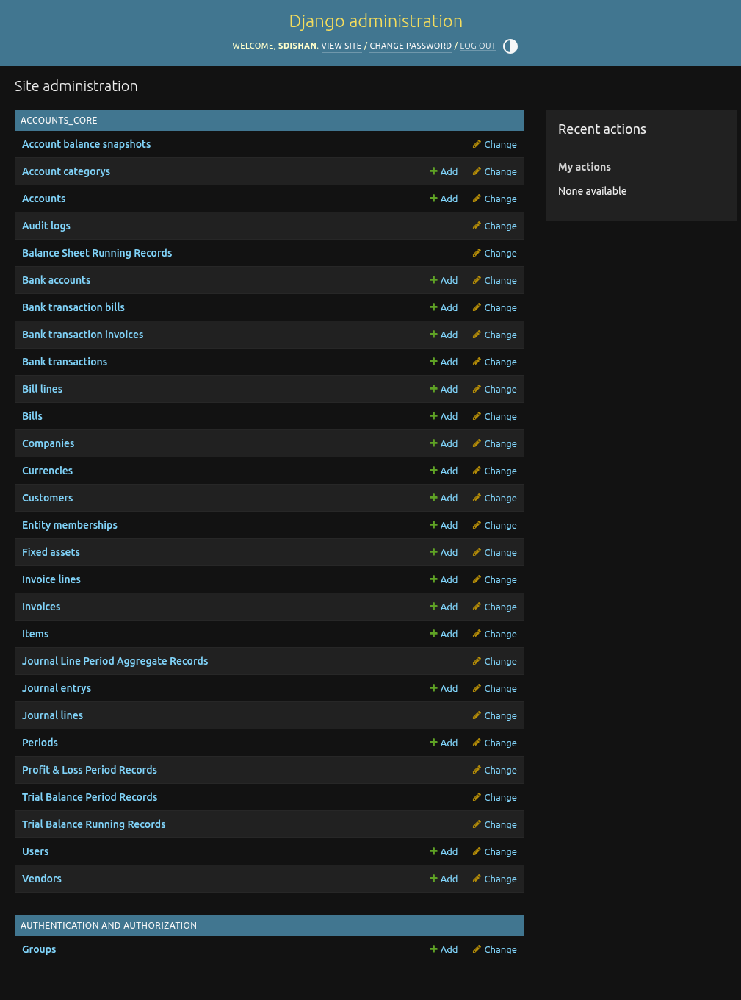
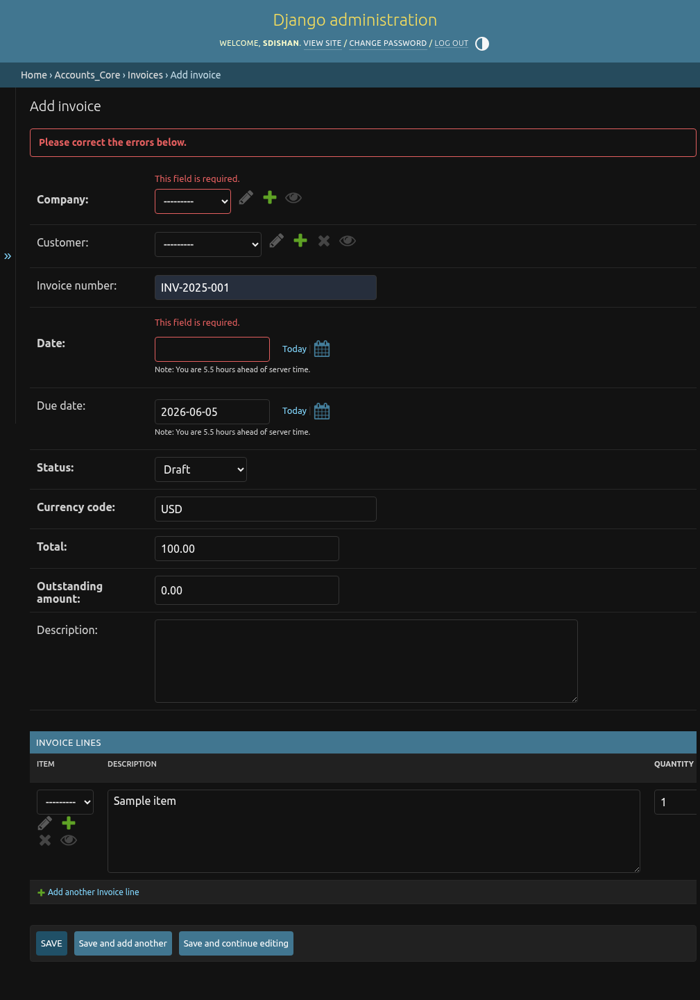
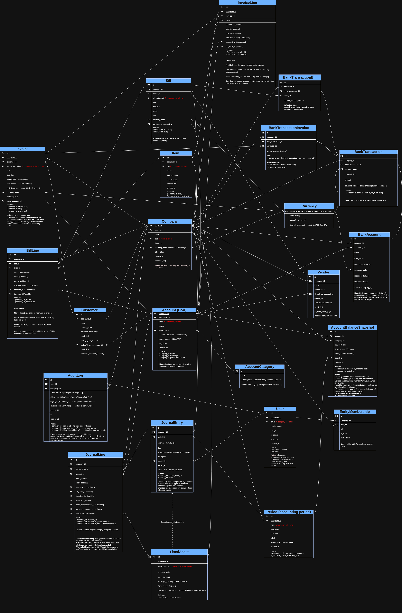
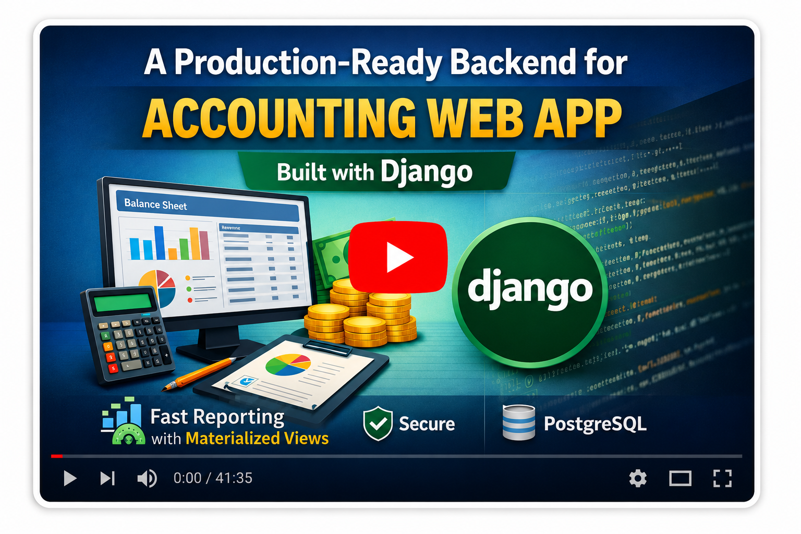

# Accounting Web App

> A production-ready Django backend implementing double-entry bookkeeping, multi-tenant isolation, and financial reporting — built from scratch as a learning project.

---

## What problem does it solve?

Small business accounting software (QuickBooks, Xero) is powerful but opaque — it's hard to understand *how* the underlying accounting actually works. This project is a ground-up implementation of core accounting mechanics, designed to be readable, testable, and extensible.

It handles the workflows a real accounting backend needs:

- **Double-entry bookkeeping** — every transaction debits one account and credits another, keeping books balanced
- **Invoices & bills** — with validation rules (no negative totals, no deleting invoices with payments attached)
- **Bank transactions** — record and reconcile payments in and out
- **Fixed-asset depreciation** — track asset value over time
- **Financial reports** — trial balance, income statement, balance sheet, cash flow, AR/AP aging
- **Multi-tenant isolation** — each company's data is fully separated
- **Admin UI** — rapid prototyping and data inspection without building a frontend first
- **Materialized views** — fast report queries even as data grows

---

## Technologies used

| Layer | Technology |
|---|---|
| Backend framework | Django (Python 3.12) |
| Database | PostgreSQL 15 (via Docker) |
| Testing | pytest |
| Code quality | black · isort · flake8 |
| Admin UI | Django Admin |
| Containerization | Docker |

---

## How does it work?

The app is structured around a set of core accounting models — `Company`, `Account`, `JournalEntry`, `Invoice`, `Bill`, `BankTransaction`, and `FixedAsset` — with strict validation baked into the model layer via `clean()` and `save()` overrides.

**Multi-tenancy** is enforced at the model level: every record is scoped to a `Company`, so queries across tenants are structurally prevented.

**Double-entry integrity** is enforced on every journal entry — debits must equal credits, or the transaction is rejected before it touches the database.

**Reports** are powered by PostgreSQL materialized views, which pre-aggregate the ledger so report queries stay fast without denormalizing the source data.

The best places to explore the codebase:

- `admin/` — all registered models, good for understanding the data shape
- `management/commands/` — demo data scripts showing how records relate to each other
- `tests/` — lifecycle tests (e.g. `test_invoice_lifecycle.py`) that document the rules enforced at each step

---

## Screenshots

### Django Admin dashboard showing registered models


### Invoice creation form with validation in action


### ER diagram 


---

## Demo video
<a href="https://youtu.be/JtRCgn8WaEs">
  
</a>

---

## Quick start

### Prerequisites
- Python 3.12
- Docker (for PostgreSQL)

### 1. Clone and set up environment

```bash
git clone https://github.com/webQbe/react-django_accounting_app.git
cd react-django_accounting_app

python3.12 -m venv .venv
source .venv/bin/activate      # Windows: .venv\Scripts\Activate.ps1

pip install -r requirements.txt
```

### 2. Start the database

```bash
docker run --name ac-postgres -e POSTGRES_PASSWORD=secret -p 5432:5432 -d postgres:15
```

### 3. Run migrations and create a superuser

```bash
python manage.py migrate
python manage.py createsuperuser
```

### 4. (Optional) Load demo data

```bash
make demo
```

Creates a **Demo Ltd** company with a demo user (`demo` / `demo123`), sample accounts, invoices, journal entries, and bank transactions — ready to explore immediately.

### 5. Start the dev server

```bash
python manage.py runserver
```

Open `http://127.0.0.1:8000/admin/` and log in. Try creating an Invoice — validation rules (`clean()` and `save()`) will fire automatically.

---

## Running tests

```bash
# Full test suite
pytest

# Single file
pytest accounts_core/tests/test_invoice_lifecycle.py
```

---

## Code quality

```bash
black .      # format
isort .      # sort imports
flake8 .     # lint
```

---

## Database operations

```bash
# Backup (Docker Postgres)
docker exec -t ac-postgres pg_dump -U postgres acdb > backup.sql

# Reset data (keeps schema)
python manage.py flush

# Migrations
python manage.py makemigrations
python manage.py migrate

# Roll back to a specific migration
python manage.py migrate app_name 0005
```

---

## Learning references

Built from scratch using:
- Accounting fundamentals — [Principles of Accounting](https://alison.com/course/principles-of-accounting), [Introduction to Business Accounting](https://alison.com/course/introduction-to-business-accounting)
- Product research — [QuickBooks](https://www.youtube.com/@quickbooks) & [Xero](https://www.youtube.com/@xero) feature walkthroughs
- Multi-tenant architecture — [Multi-Tenant SaaS in 3 Simple Steps](https://www.youtube.com/watch?v=bFLGwVyIotA)
- Database design — [Advanced Diploma in Database Systems](https://alison.com/course/advanced-diploma-in-database-systems)

---

## License

MIT